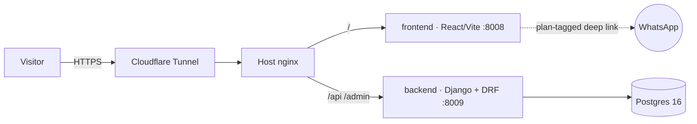

<p align="center"></p>

# Simon Host — Hosting for Small Businesses and Small Builders

**Live:** [simonhost.navonsimon.com](https://simonhost.navonsimon.com) · Hebrew RTL

An independent hosting company sold as four rungs of one ladder: *how much do you want to do yourself.* A finished website at ₪99/month, managed WordPress hosting (migration included) at ₪49, your app running with a managed Postgres at ₪149, or a private server with the keys handed over at ₪79. The prices don't ascend, and that's the pitch — you pay for my time, not the hardware. Around the hosting sits a community of entrepreneurs: events, a group, and a founder who answers the WhatsApp himself.

## Highlights

- **One axis, four products** — the site is organised around a single involvement bar: solid orange is my share of the work, hatched is yours. It recurs in the hero as a descending staircase, in the pricing grid, and on every landing page, so the product line explains itself before a word is read.
- **Twenty-one prerendered pages** — the homepage, service and offer pages, a sixteen-project work library, a blog index, six practical guides and six project case studies. Every route is emitted as complete static HTML with its own title, canonical, Open Graph tags and connected structured data, plus generated sitemap and RSS files. React Router hydrates on top for client-side navigation.
- **Priced against the actual market** — the Israeli VPS field runs ₪89–₪175 for a comparable box; shared hosting runs ₪25–₪99 without anyone building the site. Each plan states what the alternative costs, on the page.
- **Zero-friction funnel** — every CTA is a WhatsApp deep link carrying a pre-filled, plan-specific message, so an inquiry identifies which rung it came from with no form, no account, and no backend round-trip.
- **Content as data** — services, offers, articles and all sixteen projects live in typed content modules. The project records connect homepage features, `/work`, screenshots, case studies, public code links and SEO schema without duplicating facts. A vitest suite (run in CI) enforces completeness and privacy rules.
- **Domain search on the homepage** — type a business name (Hebrew works) and get live availability across co.il/com/net/io from ISOC-IL whois and RDAP; a free domain ends in a WhatsApp button pre-filled with it.
- **Full-stack TypeScript + Python** — React 19 + Vite + TypeScript frontend; Django + DRF backend with `leads` (the CRM), `domains` (availability lookups) and `events` (WhatsApp click analytics) apps.
- **Hardened by default** — API rate-limiting, CSRF protection, secrets in `.env`, containers bound to localhost only behind host nginx + Cloudflare Tunnel.
- **Three-container topology** — frontend, backend, and Postgres 16 with healthchecks, one `docker compose up` from clean checkout to serving.

## Pages

| Route | Page | Content module |
|---|---|---|
| `/` | Homepage — hero, pricing grid, offer strip, infrastructure, about, community, portfolio, FAQ | `services.ts`, `community.ts`, `portfolio.ts` |
| `/wordpress` | Managed WordPress hosting — ₪49/mo | `services.ts` |
| `/websites` | Finished website, built + hosted — ₪99/mo | `services.ts` |
| `/apps` | App + managed Postgres — ₪149/mo | `services.ts` |
| `/vps` | Private server — ₪79/mo | `services.ts` |
| `/agencies` | Offer A: agencies overpaying for hosting — free bill audit, one site migrated free for 14 days, no invoice until every site is live | `offers.ts` |
| `/launch` | Offer B: 30 days from idea to launched product — free written build plan, "keep building until live" guarantee | `offers.ts` |
| `/work` | Sixteen verified projects in four editorial chapters, with live links and privacy-safe screenshots | `portfolio.ts` |
| `/blog` | Six search-intent guides and six project case studies | `articles.ts` |
| `/blog/:slug` | Prerendered guide or case study with BlogPosting and breadcrumb schema | `articles.ts`, `portfolio.ts` |

## Launch gates

Content the site ships without until Simon supplies or approves it. Each gate is a constant, and the vitest suite fails if the gated content leaks past it.

| Gate | Where | Off means |
|---|---|---|
| `COMMUNITY.groupLink` | `content/community.ts` | Join-group CTA is not rendered |
| Private project repository links | `content/portfolio.ts` | A private record may link its public site, but never its repository; tests enforce the rule |
| Project screenshots | `public/projects/` | Only public, logged-out pages or already-public repository artwork are captured; no dashboards or customer data |
| `CASE_STUDY_APPROVED` | `content/offers.ts` | The agency story states no figures at all — no account counts, no bills, no percentages — until the anonymized case is approved |
| `CAPACITY_PER_MONTH` | `content/offers.ts` | The agency scarcity line says "a limited number of migrations a month" instead of a real number; set it to the true capacity to publish it |
| `HAS_PHOTO` | `components/About.tsx` | About section renders without a photo |

## Architecture



## Domain search

`GET /api/domains/check/?q=<name>` — the `domains` app validates and
IDNA-encodes the query (max 100 chars), fans a bare name out across
`co.il`, `com`, `net`, `io` (a full domain checks only itself), and returns
`available` / `taken` / `unknown` per domain. `.il` is answered by the
ISOC-IL whois server, a fixed allowlist of global TLDs by RDAP; anything
else is `unknown` rather than guessed. Results are cached 10 minutes;
anonymous throttle 60/hour. The homepage `DomainSearch` section is the only
consumer — debounced input, Hebrew status chips, and a WhatsApp CTA on
available results.

## Analytics & CRM

- **`POST /api/events/`** — the `events` app records one anonymous
  `ClickEvent` per WhatsApp click: `kind`, `page` (site path), `campaign`,
  `utm_source/medium/campaign`, and the referrer's host only. All fields are
  bounded, garbage is a 400, throttle 120/hour, and `text/plain` JSON is
  accepted so `navigator.sendBeacon` works. Read-only admin at
  `/admin/events/clickevent/` with filters by page, source, campaign and
  date.
- **`campaign` prop** — every `<WhatsAppButton>` names its spot on the site:
  `hero`, `card-<slug>`, `page-<slug>`, `community-events`, `contact`,
  `domain-search`. On click the button beacons the event (fetch keepalive
  fallback) and never delays the navigation.
- **utm capture** — `frontend/src/lib/utm.ts` reads `utm_source`,
  `utm_medium`, `utm_campaign` from the landing URL once per tab into
  `sessionStorage` (first touch; a later tagged visit overrides), and the
  click beacon carries them along.
- **Leads admin = CRM** — `/admin/leads/lead/` is the pipeline. `Lead` has
  `source` (site / whatsapp / warm / cold-email / linkedin / referral /
  other), `stage` (new → contacted → audit-sent → plan-sent → migrating →
  won / lost), `company` and `notes`; stage and source are edited inline in
  the list view. The public `/api/leads/` form can only create `source=site`,
  `stage=new` rows.

## Run it

```bash
cp .env.example .env   # fill in secrets
docker compose up -d --build
```

Local dev: `python manage.py runserver 127.0.0.1:8009` in `backend/`
(`DJANGO_SQLITE=1` skips Postgres) and `npm run dev` in `frontend/` — Vite
proxies `/api` to 8009. Tests: `npm test` in `frontend/`, and
`DJANGO_SQLITE=1 DJANGO_SECRET_KEY=ci DJANGO_ALLOWED_HOSTS=testserver python manage.py test`
in `backend/` (both run in CI).

---

Built by **Simon Navon** — [consulting.navonsimon.com](https://consulting.navonsimon.com)

## Deploy pipeline

CI builds the frontend on every PR. Merging to `main` deploys itself: a
systemd timer on the server checks `origin/main` every minute and, on a new
commit, fast-forwards and rebuilds the compose stack (`deploy/deploy.sh`).
Merged branches are deleted automatically.
