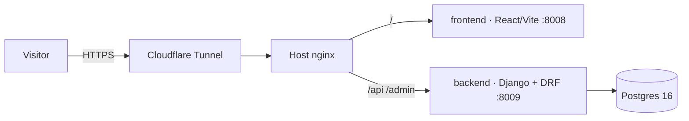

<p align="center"></p>

# Simon Host — Websites-as-a-Service for Small Businesses

**Live:** [simonhost.navonsimon.com](https://simonhost.navonsimon.com) · Hebrew RTL

A productized service: a professional website for your business at a flat ₪99/month — design, hosting, domain, and maintenance included. The site is both the storefront and the machine: a polished React landing page feeding a Django lead-capture engine, with every inquiry landing in a management dashboard.

## Highlights

- **Full-stack TypeScript + Python** — React 18 + Vite + TypeScript frontend; Django + DRF backend with a dedicated `leads` app (model, serializer, validation, admin workflow).
- **Lead pipeline built for follow-up** — inquiries are stored, timestamped, and worked through Django admin as a mini-CRM rather than lost in an inbox.
- **Hardened by default** — API rate-limiting, CSRF protection, secrets in `.env`, containers bound to localhost only behind host nginx + Cloudflare Tunnel.
- **Three-container topology** — frontend, backend, and Postgres 16 with healthchecks, one `docker compose up` from clean checkout to serving.

## Architecture



## Run it

```bash
cp .env.example .env   # fill in secrets
docker compose up -d --build
```

---

Built by **Simon Navon** — [consulting.navonsimon.com](https://consulting.navonsimon.com)
