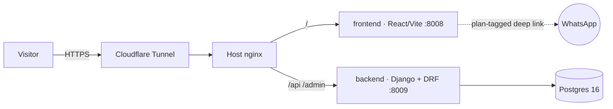

<p align="center"></p>

# Simon Host — Hosting for Small Businesses and Small Builders

**Live:** [simonhost.navonsimon.com](https://simonhost.navonsimon.com) · Hebrew RTL

An independent hosting company sold as four rungs of one ladder: *how much do you want to do yourself.* A finished website at ₪99/month, managed WordPress hosting (migration included) at ₪49, your app running with a managed Postgres at ₪149, or a private server with the keys handed over at ₪79. The prices don't ascend, and that's the pitch — you pay for my time, not the hardware. Around the hosting sits a community of entrepreneurs: events, a group, and a founder who answers the WhatsApp himself.

## Highlights

- **One axis, four products** — the site is organised around a single involvement bar: solid orange is my share of the work, hatched is yours. It recurs in the hero as a descending staircase, in the pricing grid, and on every landing page, so the product line explains itself before a word is read.
- **Five prerendered pages** — the homepage plus a landing page per service (`/wordpress`, `/websites`, `/apps`, `/vps`), each emitted as complete static HTML with its own title, canonical, Open Graph tags and Service/FAQ structured data, plus a generated sitemap. React Router hydrates on top for client-side navigation.
- **Priced against the actual market** — the Israeli VPS field runs ₪89–₪175 for a comparable box; shared hosting runs ₪25–₪99 without anyone building the site. Each plan states what the alternative costs, on the page.
- **Zero-friction funnel** — every CTA is a WhatsApp deep link carrying a pre-filled, plan-specific message, so an inquiry identifies which rung it came from with no form, no account, and no backend round-trip.
- **Content as data** — the four services live in one typed module (`frontend/src/content/services.ts`), each carrying its homepage card and its whole landing page; community and portfolio have modules of their own. Changing a price or a bullet is a one-line edit, not a JSX hunt — and a vitest suite (run in CI) enforces completeness and the launch gates.
- **Full-stack TypeScript + Python** — React 19 + Vite + TypeScript frontend; Django + DRF backend with a `leads` app (model, serializer, validation, admin workflow) kept for the self-serve signup path.
- **Hardened by default** — API rate-limiting, CSRF protection, secrets in `.env`, containers bound to localhost only behind host nginx + Cloudflare Tunnel.
- **Three-container topology** — frontend, backend, and Postgres 16 with healthchecks, one `docker compose up` from clean checkout to serving.

## Architecture



## Run it

```bash
cp .env.example .env   # fill in secrets
docker compose up -d --build
```

---

Built by **Simon Navon** — [consulting.navonsimon.com](https://consulting.navonsimon.com)

## Deploy pipeline

CI builds the frontend on every PR. Merging to `main` deploys itself: a
systemd timer on the server checks `origin/main` every minute and, on a new
commit, fast-forwards and rebuilds the compose stack (`deploy/deploy.sh`).
Merged branches are deleted automatically.
